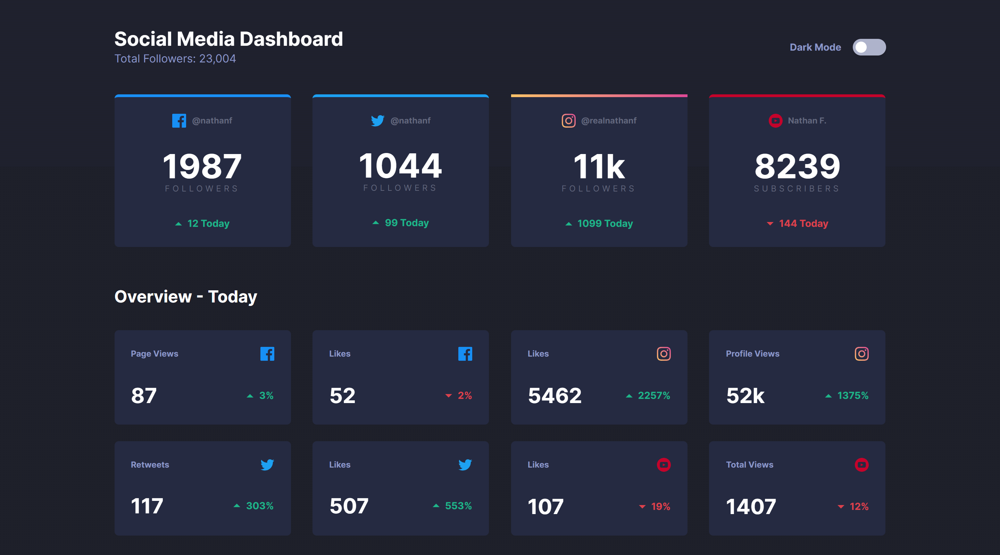

# Mentor de interfaz de usuario: Sitio web multipágina de turismo espacial.

Esta es una solución para el desafío [Social media dashboard with theme switcher challenge on Frontend Mentor](https://www.frontendmentor.io/challenges/social-media-dashboard-with-theme-switcher-6oY8ozp_H) Los desafíos de Frontend Mentor lo ayudan a mejorar sus habilidades de codificación mediante la creación de proyectos realistas.

## Tabla de contenido

- [Resumen](#descripcion-general)
  - [El desafío](#el-reto)
  - [Captura de pantalla](#captura-de-pantalla)
  - [Enlaces](#enlaces)
- [Mi proceso](#mi-proceso)
  - [Construido con](#construido-con)
  - [Desarrollo continuo](#desarrollo-continuo)
- [Autor](#autor)
- [Agradecimientos](#agradecimientos)

## Descripción general

### El reto

Los usuarios deberían poder:

- Ver el diseño óptimo para el sitio según el tamaño de pantalla de su dispositivo
- Ver estados de desplazamiento para todos los elementos interactivos en la página
- Alternar el tema de color según sus preferencias

### Captura de pantalla

### Enlaces

- URL de la solución: [https://github.com/Torres2000/space-tourism-website](https://github.com/Torres2000/space-tourism-website)
- URL del sitio en vivo: [https://space-tourism-space-web-site.netlify.app/](https://space-tourism-space-web-site.netlify.app/)

## Mi proceso

### Construido con

- Marcado semántico HTML5
- Propiedades personalizadas de CSS
- Caja flexible
- Cuadrícula CSS
- Flujo de trabajo móvil primero
- [React](https://reactjs.org/) - Biblioteca JS
- [Next.js](https://nextjs.org/) - Marco de reacción
- [Tailwind CSS](https://tailwindcss.com/) - Para estilos

`

## Autor

- Sitio web - [Pedro Torres](https://portafoliowebdevjose.netlify.app)
- Mentor de frontend - [@Torres2000](https://www.frontendmentor.io/profile/Torres2000)

## Agradecimientos

Solo un saludo a todos los demás creadores de Frontend Mentor. Es una experiencia de aprendizaje maravillosa ver otras soluciones y ver cómo otros codificadores crean lo mismo.
